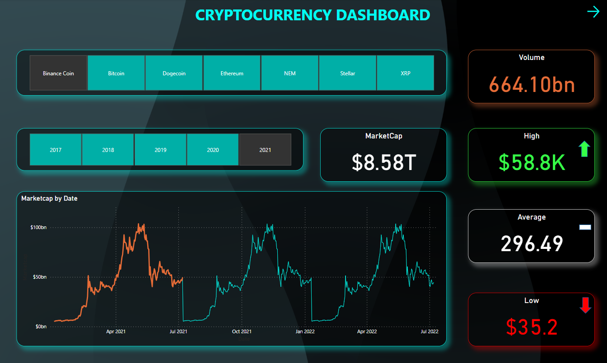

# 📈 Crypto Data Analytic (Power BI Dashboard)

A Power BI project that visualizes cryptocurrency market data using Excel as the data source. This dashboard helps analyze trends, prices, and performance of various crypto tokens.

---

## 🔍 Project Overview

This project demonstrates how to convert raw Excel data into insightful, interactive visualizations using Power BI.

### 💡 Key Insights:
- Token-wise volume and price analysis
- Interactive line charts and KPIs
- Monthly trading trends
- Visual snapshot of overall market behavior

---

## 📂 Files Included

| File Name                     | Description                               |
|------------------------------|-------------------------------------------|
| `CryptoCurrency_Dashboard.pbix` | Main Power BI dashboard file            |
| `CryptoData.xlsx`            | Raw data source used in Power BI          |
| `Dashboard_Snapshot.png`     | Screenshot of the final dashboard         |
| `PDF Representation`         | Document explaining the dashboard layout  |

---

## 🛠 Tools Used

- **Power BI** – for dashboard development  
- **Excel** – for storing and preparing data  
- **GitHub** – for hosting the project  

---

## 🖼️ Dashboard Preview

---

## 🚀 How to View the Dashboard

1. Download the `.pbix` file
2. Open in Power BI Desktop
3. Explore the visuals and interact with slicers

---

## 👨‍💻 Author

**Dhruv Agarwal**  
[GitHub Profile](https://github.com/agarwaldhruv710)

---

## 📝 License

This project is open source under the [MIT License](LICENSE).
